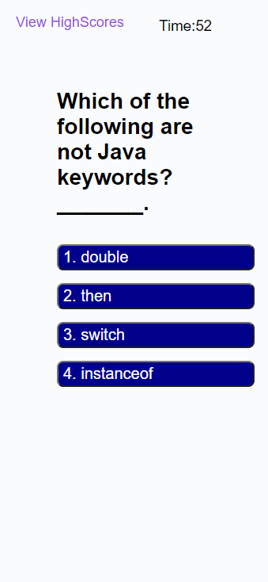

# JavaScriptQuiz

A timed quiz on JavaScript fundamentals that stores high scores to gauge my progress compared to my peers

## JavacodeQuizChallenge #4

## Description

A javascript 6 related question quiz. Only 85 seconds to answer, within the time
limit. Keep in mind that incorrect answers will penalize your
score and time, by ten seconds!

## Screenshot

## Website

